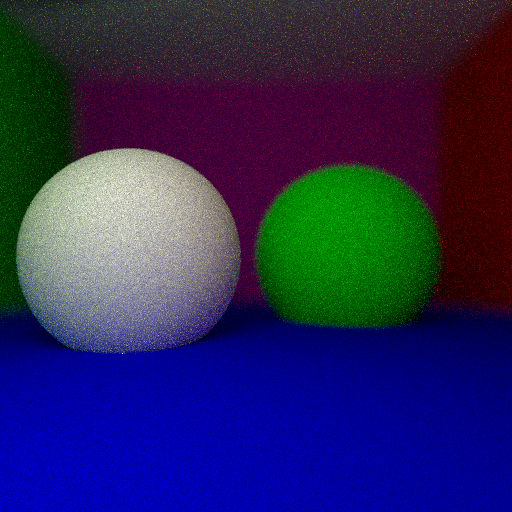

Fait par Théo Ponton le 24/03/2019

# Ray Tracing - MOS 2.2 Infographie

## Introduction

<p style="text-align: justify">Le but de ce projet est de réaliser une scène 3D à l'aide d'un traceur de rayons. Il s'agit de reproduire les mouvements faits pas les rayons émanant d'une source de lumière. En plaçant une caméra dans cet espace 3D, nous allons conserver la couleur des rayons qui intersectent la grille de cette dernière. Ceci va consister en notre visualisation de notre scène. </p>

<p style="text-align: justify">Pour plus de facilité, nous ferons partir non pas les rayons depuis la source de lumière, mais depuis la caméra. Cela est possible en utilisant la réciprocité d'Helmholtz. </p>

Cette technique est notamment utilisée au cinéma sur des films comme Avatar. 

<p style="text-align: justify">Dans ce rapport, je vais détailler un certain nombre de fonctionnalités que j'ai mis en place.  Elles sont toutes disponibles dans le code main.cpp présent dans le repository Github.</p>

## Algorithme général

<p style="text-align: justify">Notre scène sera représentée par un objet <i>Scene</i>. Cet objet a un attribut <i>objects</i>, il s'agit d'une liste éléments de type <i>object</i>. Ces objets peuvent être de différentes natures : </p>

- Des sphères (en 3D) : objet <i>sphere</i> descendant de l'objet <i>object</i>. Afin de faire apparaître des parois à notre scène, nous allons insérer 6 très grandes sphères dans la scène.
- Des triangles (en 2D) : objet <i>triangle</i> descendant de l'objet <i>object</i>
- Des maillages qui sont composés de plein de petits triangles : objet <i>geometry</i> descendant de <i>object</i>

<p style="text-align: justify">Une fois que nous avons des objets dans notre scène, il faut définir les rayons de lumière. Il s'agit tout simplement. D'un point de départ <i>C</i> et d'une direction <i>u</i>. Chaque rayon va être lancé depuis la un partie de la grille de la caméra qui sont représentés comme l'ensemble des (j-largeur/2+0.5, i-hauteur/2+0.5, -hauteur/(2xtan(fov/2))) pour <i>(i, j)</i> dans [0, 511]². </p>

<p style="text-align: justify">La méthode de la classe <i>Scene</i> <i>getColor(Ray& r, double& epsilon, int bounce, double n_sphere, double n_air)</i> va renvoyer pour chacun des pixels un vecteur RGB qui correspondra à la couleur du pixel. Il prend notamment en argument le rayon lancé. Il se structure de la manière suivante :</p>

```cpp
Vector getColor(Ray& r, double& epsilon, int bounce, double n_sphere, double n_air)
{
	Vector pixelColor(0, 0, 0);
	Vector P, N, color;
	Object* S;
	if (intersect(r, P, N, S, color) && bounce > 0) {
		if (S->mirror)
		{
			... 
			pixelColor = getColor(r_reflect, epsilon, bounce - 1, n_sphere, n_air);
		}
		else if (S->transparent)
		{
			...
			if (dotP > 0) {
				...
				pixelColor = getColor(r_ref, epsilon, bounce - 1, n_sphere, n_air);
			}
			else 
			{
				...
				pixelColor = getColor(r_ref, epsilon, bounce - 1, n_sphere, n_air);
			}
		}
		else if (S->light)
		{
			pixelColor = Vector(1., 1., 1.);
		}
		else
		{
			...
			if (intersect(rprime, Prime, Nprime, Sprime, colorprime)) {
				Vector PrimeP = P - Prime;
				if (PrimeP.norm2() < dist_lum)
				{
					pixelColor = Vector(0, 0, 0);
				}
				else
				{
					pixelColor = I / (4 * M_PI*dist_lum) * (color / M_PI) * 
					dot(PxPrime, N) * dot(-1. * PxPrime, Nprimee) / dot(Nprimee, OX);
				}
			}
			else
			{
				pixelColor = I / (4 * M_PI*dist_lum) * (color / M_PI) * dot(PxPrime, N) 				* dot(-1. * PxPrime, Nprimee) / dot(Nprimee, OX);
			}
			...
			pixelColor = pixelColor + color * getColor(r_diffusion, epsilon, bounce, 			 n_sphere, n_air);
		}
	}
	return pixelColor;
};
```

<p style="text-align: justify">Tout d'abord, la méthode <i>intersect()</i> de la classe <i>Scene</i> est utilisée. Elle va parcourir l'ensemble des <i>object</i> de la scène et tester  pour chacun de ces <i>object</i> leur méthode <i>intersect()</i>. Voici un peu plus en détail ces méthodes <i>intersect</i> pour chacun des objets :</p>

- <p style="text-align: justify"><b>Sphère</b> : pour qu'il y ait un point P d'intersection entre le rayon et la sphère, il existe un t>0 tel que P = C + t*u et ||P-O|| = R où R et O sont le rayon et le centre de la sphère. Ces deux équations nous amènent à une équation du second degré en t. Il suffira alors de prendre la solution (si elle existe) avec le plus petit t négatif. </p>

  ```cpp
  virtual bool intersect(const Ray& r, Vector& P, Vector& N) {
  	double a = 1;
  	double b = 2 * dot(r.u, r.C - O);
  	double c = (r.C - O).norm2() - R * R;
  	double delta = b * b - 4 * a*c;
  	if (delta >= 0) {
  		double t1 = (-b - sqrt(delta)) / (2 * a);
  		double t2 = (-b + sqrt(delta)) / (2 * a);
  		if (t1 > 0) {
  			P = t1 * r.u + r.C;
  			N = P - O;
  			N.normalize();
  		}
  		else {
  			if (t2 > 0) {
  				P = t2 * r.u + r.C;
  				N = P - O;
  				N.normalize();
  			}
  			else {
  				return false;
  			}
  		}
  	}
  	return delta >= 0;
  };
  ```

  

- <p style="text-align: justify"><b>Triangle</b> : il s'agit d'abord de considérer le plan qui contient le triangle. Le <i>t</i> calculé ci-dessous correspond à l'intersection entre le rayon et le plan. Il est de tel sorte que le point d'intersection P se mette sous la forme <i>P = C + t * u</i>. Une fois ce point d'intersection obtenu, il s'agit de calculer les coordonnées barycentriques de P par rapport au triangle. Il s'agit de <i>alpha, beta, gamma</i> tels que leur somme fait 1 et que <i>P = alpha * A + beta * B + gamma * C</i>. Ces coordonnées barycentriques s'obtiennent en résolvant un système d'équations linéaires. P intersecte le triangle si et seulement si ces trois coordonnées sont plus petites que 1.</p>

  ```cpp
  virtual bool intersect(const Ray& r, Vector& P, Vector& N) {
  	N = cross(B - A, C - A);
  	N.normalize();
  	if (dot(r.u, N) > 0)
  	{
  		N = -1. * N;
  	}
  	double t = dot(A - r.C, N) / dot(r.u, N);
  	P = t * r.u + r.C;
  	double det_matrix = (B - A).norm2()*(C - A).norm2() - pow(dot(B - A, C - A),        2.);
  	double beta = (dot(P - A, B - A)*(A - C).norm2() - dot(C - A, B - A)*dot(P - A,      C - A)) / det_matrix;
  	double gamma = ((B - A).norm2()*dot(P - A, C - A) - dot(B - A, C - A)*dot(P -        A, B - A)) / det_matrix;
  	double alpha = 1 - beta - gamma;
  	if (beta >= 0 && beta <= 1 && gamma >= 0 && gamma <= 1 && alpha >= 0 && alpha            <= 1 && t >= 0) {
  		return true;
  	}
  	else {
  		return false;
  	}
  ```

- <p style="text-align: justify"><b>Geometry</b> : il suffit de tester naïvement l'intersection avec chacun des triangles le composant. Nous verrons dans la partie dédiée à cet objet comment cela a pu être optimisé. </p>

<p style="text-align: justify">Si nous reprenons donc <i>getColor()</i>, si une intersection a été trouvée, le point d'intersection, la normale ainsi que l'objet en question seront retourné. Il faut alors analyser la surface de l'objet qui peut être de 4 types différents : miroir, transparent, lumière ou diffus. Pour le cas de la lumière, la couleur renvoyée sera toujours blanche (1, 1, 1). Pour les surfaces diffuses, la couleur sera de la forme constante * albedo / distance_lumiere² sauf si la surface est cachée par une ombre. A cette couleur s'ajoutera la couleur du nouveau rayon réfléchi. Cette couleur sera tout de même multipliée par l'albedo pour garder une couleur de diffusion des plus réalistes. Pour les miroirs et objets transparents, la couleur sera directement celle du rayon réfléchi, respectivement réfracté. Nous avons donc des appels récursifs à getColor(). Ces appels récursifs s'arrêtent lorsque le nombre de rebond <i>bounce</i> tombe à zéro. Il y a terminaison car à chaque étape, on enlève 1 à <i>bounce</i>.</p>

## Les ombres

<p style="text-align: justify">Si l'on prend l'algorithme le plus naïf qu'il soit : si l'on touche une surface qui n'est ni transparente, ni un miroir, on renvoie la couleur de l'objet divisée par la distance au carré à la source de lumière sauf si le point est dans l'ombre. Un point est dans l'ombre si le rayon partant de ce point vers la source ponctuelle de lumière intersecte un objet. Et que cette intersection a lieu entre le point et la source de lumière. En codant les choses de cette manière, nous allons avoir un résultat comme suit :</p>


<p style="text-align: justify">Nous pouvons observer que les ombres sont très nettement marquées, ce qui n'est pas tout à fait le cas dans la réalité. Pour cela, nous allons mettre en œuvre l'équation du rendu. Un rayon lorsqu'il arrive sur une surface, se réfléchie dans des directions aléatoires autour de la normale. Il s'agit d'une loi normale centrée autour de cette normale. L'équation du rendu, indique que la couleur en un point correspond à émissivité de la surface (sa couleur intrinsèque, ce qui a été calculé jusqu'à maintenant) plus les couleurs des multiples rayons réfléchis et qui aller taper d'autres surface. Ces couleurs sont multipliées par l'albedo de la surface actuelle. Ainsi, lors de la rencontre de chaque surface, nous allons tirer aléatoirement un rayon pour ajouter une composante indirecte à la lumière. Notons, que nous ne tirerons qu'un seul rayon alors que l'équation du mouvement stipule d'en tirer plusieurs. Si nous faisons cela, la complexité va exploser. Nous contournerons ce problème en lançant plusieurs rayons depuis chaque pixel de la caméra.</p>

Le code suivant permet de tirer ce rayon :

```cpp
std::default_random_engine e;
std::uniform_real_distribution<double> U(0, 1);

double r1 = U(e);
double r2 = U(e);
Vector T1 = create_T1(N);
Vector T2 = cross(N, T1);
Vector wi_1 = cos(2 * M_PI*r1)*sqrt(1 - r2) * T1;
Vector wi_2 = sin(2 * M_PI*r1)*sqrt(1 - r2) * T2;
Vector wi_3 = sqrt(r2) * N;
Ray r_diffusion = Ray(P + epsilon * N, wi_1 + wi_2 + wi_3);
```

N est la normale et la fonction <i>create_T1(N)</i> permet de créer un vecteur tangent à la surface. Le epsilon est utilisé pour éviter le bruit dû à l'instabilité numérique. 

En faisant ceci et en considérant un nombre maximal de rebond à 5 et 30 rayons, nous obtenons ceci :


<p style="text-align: justify">Les ombres sont déjà moins marquées. Pour faire un rendu encore plus réaliste, nous pouvons considérer une source de lumière sphérique. Ainsi, nous pouvons tirer aléatoirement un point sur cette surface grâce à la fonction <i>getRandomPointLight</i> et réaliser le même travail qu'avec la source ponctuelle avec ce point tiré au sort. L'effet sera d'adoucir les bordures des ombres :</p>


## Anti-aliasing et flou artistique

En zoomant, nous nous rendons compte que les contours des sphères sont pixélisés :


<p style="text-align: justify">Le problème vient du fait que le lancer de rayon est déterministe, du moins au début. En effet, le rayon part toujours du milieu du pixel. Le code suivant permet de choisir de manière aléatoire, la position dans le pixel. L'aléatoire est en réalité une loi normale centrée en le milieu du pixel.</p>

```cpp
double r1 = U(e);
double r2 = U(e);
double offsetx = cos(2 * M_PI*r1)*sqrt(-2 * log(r2))*0.5;
double offsety = sin(2 * M_PI*r1)*sqrt(-2 * log(r2))*0.5;
u = Vector(j - W / 2 + offsetx, -i + H / 2 + offsety, -W / (2 * tan(fov / 2)));
```

Voici donc le résultat obtenu :


<p style="text-align: justify">Le flou artistique vient de l'optique géométrique. Les rayons qui partent de la caméra sont parallèles entre eux, donc l'image ne sera nette qu'au niveau de la distance focale. Comme le montre le schéma ci-dessous :</p>


Il faut donc bouger légèrement la caméra pour avoir ce flou. Voici le code permettant de le faire :

```cpp
double r3 = U(e);
double r4 = U(e);
double offsetx_C = cos(2 * M_PI*r3)*sqrt(-2 * log(r4));
double offsety_C = sin(2 * M_PI*r3)*sqrt(-2 * log(r4));
CPrime = Vector(C.x + offsetx_C, C.y + offsety_C, C.z);
Vector focal_P = C + focal_distance * u;
uPrime = focal_P - CPrime;
uPrime.normalize();
```

Comme tout à leur, on génère une loi centrée en le centre de la caméra. 



<p style="text-align: justify">Le résultat ci-dessus montre bien à gauche une image sans utilisation du flou, et à droite une image avec son utilisation. La boule verte est plus floue sur l'image de droite que celle de gauche. </p>

## Le maillage

<p style="text-align: justify">Nous l'avons défini tout à leur, le maillage est un ensemble de plusieurs triangles. Néanmoins, si nous devions tester l'intersection avec chacun des triangles pour tester l'intersection globale, cela prendrait énormément de temps. </p>

<p style="text-align: justify">L'idée est de définir un arbre de boites englobantes recouvrant entièreté du maillage. Une boite englobante est un objet <i>BBox</i>. C'est un parallélépipède rectangle parallèle aux axes (x, y, z). Il est donc défini par deux vecteurs <i>bmin</i> et <i>bmax</i> le point minimal (resp. maximal) sur les trois axes. L'arbre de boites englobantes est un objet <i>BVHNode</i> défini récursivement. Il contient un fils gauche <i> fg</i> et un fils droit <i>fd</i>. Chaque <i>BVHNode</i> contient une boîte englobante <i>b</i>. Il indique également dans la liste des triangles un <i>début</i> et une <i>fin</i>.</p>

<p style="text-align: justify">Cet arbre va être construit de la manière suivante, on initialise la racine de l'arbre à la boite englobante en prenant simplement le maximum et le minimum des points composant le maillage. <i>debut</i> et <i>fin</i> sont initialisé à 0 et à l'indice de fin de la liste. A chaque étape, on va analyser dans quelle dimension la boite est la plus grande et nous allons définir un plan sécant selon cette dimension. A l'aide d'un pivot, nous allons trier la liste entre <i>debut</i> et <i>fin</i> de telle sorte qu'à gauche du pivot, les barycentres des triangles correspondants soient d'un côté du plan et les autres de l'autre. Puis, si le pivot est différent du début et de la fin, nous allons rappeler ce processus entre <i>debut</i> et <i>pivot</i> et entre <i>pivot</i> et <i>fin</i>. C'est la fonction <i>build_node</i> qui fait ce travail-là :</p>

```cpp
void build_node(BVHNode& node) {
	if (node.fin - node.debut > 5) {
		Vector axe;
		double value = node.b.get_plan_separateur(axe);
		int pivot = node.debut;
		for (int i = node.debut; i < node.fin; i++)
		{
			Vector center = (vertices[indices[i].vtxi] + vertices[indices[i].vtxj] +                vertices[indices[i].vtxk]) / 3;
			if (dot(center, axe) < value)
			{
				std::swap(indices[i], indices[pivot]);
				pivot++;
			}
		}
		if (pivot != node.fin && pivot != node.debut) {
			BBox fg_box = create_box(node.debut, pivot);
			node.fg = new BVHNode(node.debut, pivot, fg_box);
			build_node(*node.fg);
			BBox fd_box = create_box(pivot, node.fin);
			node.fd = new BVHNode(pivot, node.fin, fd_box);
			build_node(*node.fd);
		}
	}
}
```

<p style="text-align: justify">Maintenant que nous avons créé ce <i>BVHNode</i>, il faut s'en servir afin de redéfinir la routine d'intersection. L'idée très simplement est la suivante : si un rayon intersecte la <i>BBox </i>de la racine alors nous allons tester l'intersection si le fils gauche et le fils droit, sinon, on ne fait rien. S'il y a intersection avec les <i>BBox</i> liées aux feuilles de l'arbre, alors on ajoute les triangles dans une liste. Cette liste constituera les triangles avec lesquels l'intersection doit être testée à la main. La méthode <i>intersect</i> de <i>BVHNode</i> va créer la liste des triangles alors que <i>intersect</i> de <i>Geometry</i> va appeler cette première méthode avant de faire le test avec chacun des triangles.</p>

```cpp
// pour BVHNode
bool intersect(const Ray& r, std::vector<BVHNode*>& leaves) {
	if (b.intersect(r)) {
		if (!fg || !fd) {

			leaves.push_back(this);
			return true;
		}
		bool found_fg = fg->intersect(r, leaves);
		bool found_fd = fd->intersect(r, leaves);
		return found_fd || found_fg;
	}
	return false;
}
```

Cette action divise les temps de calcul de mon ordinateur par 7. Voici donc ce que j'obtiens avec 80 rayons et 5 rebonds : 


## Correction Gamma

<p style="text-align: justify">L'image ci-dessus a été obtenue avec une correction gamma, c'est a dire que l'on a mis à la puissance 0.45 chaque composante de la couleur. Cela permet de rééquilibrer les niveaux de couleur. Voici donc les lignes de code en rajoutant la correction Gamma :</p>

```cpp
image[(i*W + j) * 3 + 0] = std::min(255., std::pow(pixelColor.x, 0.45));
image[(i*W + j) * 3 + 1] = std::min(255., std::pow(pixelColor.y, 0.45));
image[(i*W + j) * 3 + 2] = std::min(255., std::pow(pixelColor.z, 0.45));
```

## Synthèse

Voici une image qui contient l'ensemble des sujets abordés : surfaces spéculaires, transparentes, les ombres, l'équation du rendu, le maillage, le flou, ... 

